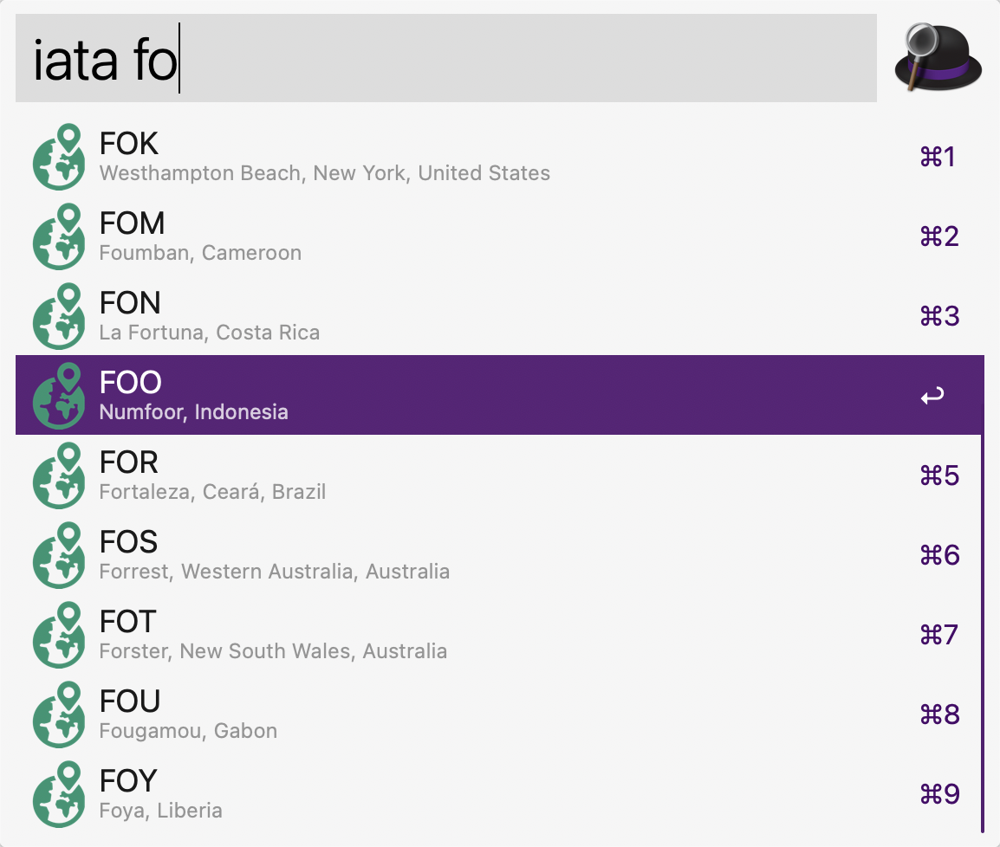

# IATA code lookup for Alfred

Provides fast lookup of 3-letter [IATA airport codes](https://en.wikipedia.org/wiki/IATA_airport_code) for the [Alfred launcher for macOS](https://alfredapp.com/).

Useful for [Cloudflare colo sites](https://www.cloudflarestatus.com/), among other things.





## Installation

Open `IATA codes.alfredworkflow` and follow Alfred's prompts.

## Usage

Open Alfred (by default, ⌘+space) and type:

```
iata <search term>
```
